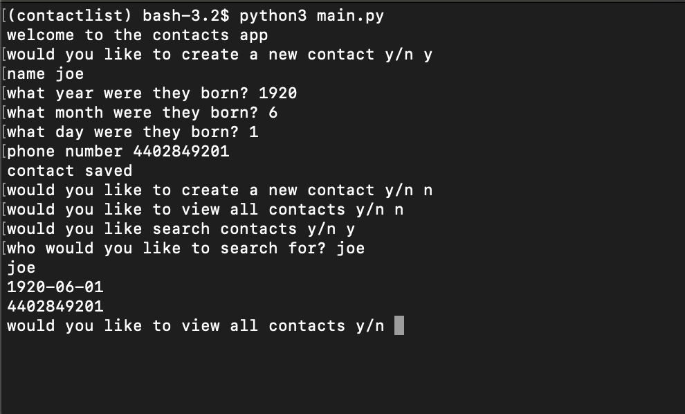

# Command Line Contacts Application

### Getting Started

in order to run this application you must have python3, pipenv,postgres, and SQL installed. open up the terminal and change into the project directory. In order for the contacts to be saved you must create a SQL database. to do so, run the command `psql` and inside the psql shell type in the command `CREATE DATABASE contacts`. Once you created the database, exit the psql shell using the command `\q`. From the root of the directory, run the command `pipenv shell`, then, inside the shell, run the command `python3 main.py`. This should run the program.

### Using the Program

once the program is running, the program will lead you through a set of prompts. Simply follow the prompts to create, search and list all of the contacts. Once you have completed the prompt the program will close. to run the program again run the command `python3 main.py`.

### Technologies Used

- Python3
- SQL
- Postgres
- Pipenv
- Peewee
